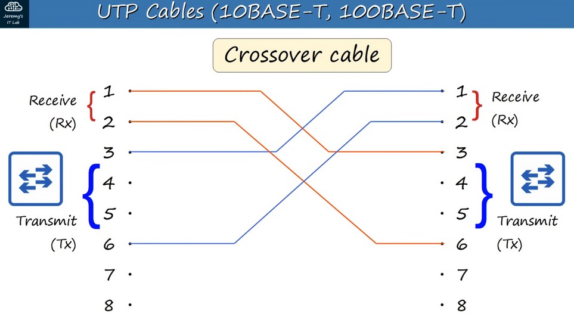

# Interface and Cables


- [Interface and Cables](#interface-and-cables)
  - [Copper UTP Cables](#copper-utp-cables)
  - [Ethernet Standards](#ethernet-standards)
  - [Cable connections](#cable-connections)
    - [10BASE-T and 100BASE-T](#10base-t-and-100base-t)
      - [Straight-through cable connections](#straight-through-cable-connections)
      - [Crossover cable connections](#crossover-cable-connections)
    - [1000BASE-T and 10GBASE-T](#1000base-t-and-10gbase-t)
  - [Fiber Optic Cable](#fiber-optic-cable)
  - [Fiber Optic Standards](#fiber-optic-standards)
  - [UTP vs Fiber-optic Cabling](#utp-vs-fiber-optic-cabling)

## Copper UTP Cables

* `Unshielded` = no metallic shield, which makes them vulnerable to **electrical** interference
* `Twisted Pair` = Literaly 4 pairs of wires with each pair twisted together, protecting against EMI (**Electromagnetic** Interference)
* `8 pins`, perfect for the number of wires

## Ethernet Standards

|Category | Speed | Common Name | Standard | Cable Type | Max Transmission Distance |
| ---| --- | --- | --- | --- | --- |
| Cat 3 | 10 Mbps | Ethernet | 802.3i | 10BASE-T | 100m Max |
| Cat 5 | 100 Mbps | Fast Ethernet | 802.3u | 100BASE-T | 100m Max |
| Cat 5e | 1 Gbps | Gigabit Ethernet | 802.3ab | 1000BASE-T | 100m Max |
| Cat 6a | 10 Gbps | 10 Gigabit Ethernet | 802.3an | 10GBASE-T | 100m Max |

* BASE = refers to Baseband Signaling
* T = Twisted Pair 
* 10BASE-T/100BASE-T = 2 pairs (4 wires) 
* 100BASE-T/10BASE-t = 4 pairs (8 wires) 

## Cable connections

* Routers transmit data on pins 1 and 2 and recieve data on pins 3 and 6
* Switches are the opposite, they recieve data on pins 1 and 2 and transmit on pins 3 and 6

### 10BASE-T and 100BASE-T

* `Full-Duplex` transmission: both connected devices can receive and transmit data at the same time

| DEVICE TYPE | TRANSMIT (TX) PINS | RECEIVE (RX) PINS |
| --- | --- | --- |
| ROUTER | 1 & 2 | 3 & 6 |
| FIREWALL | 1 & 2 | 3 & 6 |
| PC | 1 & 2 | 3 & 6 |
| **SWITCH** | **3 & 6** | **1 & 2** |

#### Straight-through cable connections

```log
1 --- 1
2 --- 2

3 --- 3
6 --- 6
```


#### Crossover cable connections

```log
1 --- 3
2 --- 6

3 --- 1
6 --- 2
```




### 1000BASE-T and 10GBASE-T

In addition to using **ALL** pairs of wires, each pair is `BI-DIRECTIONAL`. This is part of the reason why they can operate at much faster speeds.

```log
1 --- 1
2 --- 2

3 --- 3
6 --- 6

4 --- 4
5 --- 5

7 --- 7
8 --- 8
```


* Devices of the same type require crossover cables or else the transmit pins will be connected to the transmit pins and recieve pins connected to recieve pins. 


## Fiber Optic Cable


* 2 Types of Fiberoptic cable
  * Single-Mode:
    * Core diameter is narrower than multimode.
    * Light enters at a single angle from a laser-based transmitter.
    * Allows longer cables than both UTP and multimode fiber.
  * Multimode: 
    * Core diameter is wider than single-mode
    * Allows multiple angles of light waves to enter the fiberglass core.
    * Allows longer cables than UTP, but shorter cables than single-mode
    * Cheaper than single-mode


## Fiber Optic Standards

| Speed | Standard | Connection Speed | Mode Support | Max Transmission Distance |
| --- | --- | --- | --- | --- |
| 1000BASE-LX | 802.3z | 1 Gbps | Multimode / Single | 550 meters (Multi)  / 5km (Single) |
| 10GBASE-SR | 802.3ae | 10 Gbps | Multimode | 400 meters |
| 10GBASE-LR | 802.3ae | 10 Gbps | Single | 10 kilometers |
| 10GBASE-ER | 802.3ae | 10 Gbps | Single | 30 kilometers |

## UTP vs Fiber-optic Cabling

| UTP | Fiber-optic |
| :-: | :-: |
| Cheaper | More expensive |
| Shorter max distance (~100m) | Longer max distance |
| Vulnerable to EMI | EMI proof |
| RJ45 ports are cheaper than SFP ports | SFP ports are more expensive (and single-mode ir more expensive than multimode) |
| Leak faint signal outside of cable (security risk) | No signal leak |
